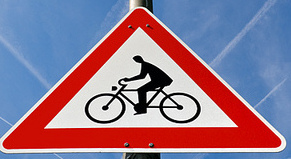
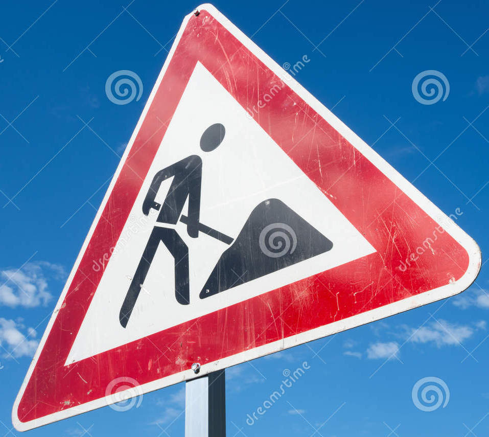
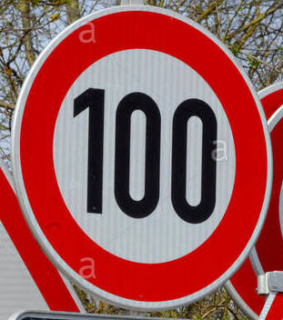
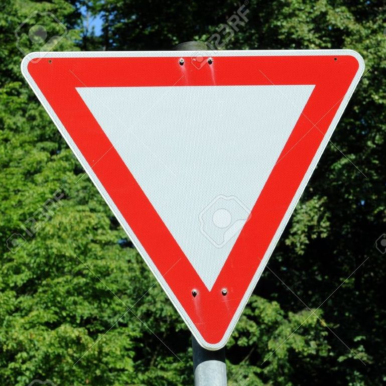
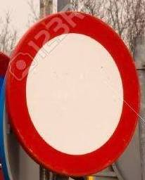

# **Traffic Sign Recognition** 

## Writeup

---

**Build a Traffic Sign Recognition Project**

The goals / steps of this project are the following:
* Load the data set (see below for links to the project data set)
* Explore, summarize and visualize the data set
* Design, train and test a model architecture
* Use the model to make predictions on new images
* Analyze the softmax probabilities of the new images
* Summarize the results with a written report

[//]: # (Image References)

[vis1]: ./examples/visualization.png "Visualization"
[vis2]: ./examples/input.png "Visualization"

## Rubric Points
### Here I will consider the [rubric points](https://review.udacity.com/#!/rubrics/481/view) individually and describe how I addressed each point in my implementation.  

---
### Writeup / README

You're reading it! and here is a link to my [project code](https://github.com/PeeJay/CarND-Traffic-Sign-Classifier-Project/blob/master/Traffic_Sign_Classifier.ipynb)

#### Note: I was using tensorflow 1.6 as I had trouble getting earlier versions to work, hence the compiler warnings ####

### Data Set Summary & Exploration

I used the built-in python array functions to calculate summary statistics of the traffic
signs data set:

* The size of training set is 34799
* The size of the validation set is 4410
* The size of test set is 12630
* The shape of a traffic sign image is [32, 32, 3]
* The number of unique classes/labels in the data set is 43

#### 2. Include an exploratory visualization of the dataset.

Here is an exploratory visualization of the data set. It is a histogram of the number of images in each input class, and also an example of one input image

![alt text][vis1]
![alt text][vis2]

### Design and Test a Model Architecture

As a first step, I shuffle the input images to help the stochastic gradient descent optimiser run more efficiently.

I also tried supplementing the data with a copy of each input image that had a random +- 20 and 70 degrees rotation applied, but I found that this had little effect on the validation accuracy, so I commented out this code.

As a last step, I normalized the image data using the tf.image.per_image_standardization so that the mean is centered about the origin, and the variance is equal between images. This can help the network train faster.

As I was obtaining better than required validation accuracy I didn't grayscale the images. I theorised that some signs can be recognised by colour so it may be useful to leave it in.

#### 2. Describe what your final model architecture looks like including model type, layers, layer sizes, connectivity, etc.) Consider including a diagram and/or table describing the final model.

My final model consisted of the following layers:

| Layer         		|     Description	        					| 
|:---------------------:|:---------------------------------------------:| 
| Input         		| 32x32x3 RGB image   							| 
| Convolution 3x3     	| 1x1 stride, valid padding, outputs 30x30x20 	|
| RELU					|												|
| Max pooling	      	| 2x2 stride,  outputs 15x15x20 				|
| Convolution 5x5	    | 1x1 stride, valid padding, outputs 11x11x28 	|
| RELU					|												|
| Convolution 5x5	    | 1x1 stride, valid padding, outputs 7x7x40 	|
| RELU					|												|
| Flatten				| outputs 1960									|
| Dropout				| keep prob. 40%								|
| Fully connected		| 416 layers   									|
| RELU					|												|
| Dropout				| keep prob. 40%								|
| Fully connected		| 150 layers   									|
| RELU					|												|
| Dropout				| keep prob. 40%								|
| Fully connected		| 43 layers   									|

#### 3. Describe how you trained your model. The discussion can include the type of optimizer, the batch size, number of epochs and any hyperparameters such as learning rate.

To train the model, I used a rate of 0.001, 10 epochs, and a batch size of 64. The Adam Optimiser from tensorflow was used.

#### 4. Describe the approach taken for finding a solution and getting the validation set accuracy to be at least 0.93. Include in the discussion the results on the training, validation and test sets and where in the code these were calculated. Your approach may have been an iterative process, in which case, outline the steps you took to get to the final solution and why you chose those steps. Perhaps your solution involved an already well known implementation or architecture. In this case, discuss why you think the architecture is suitable for the current problem.

My final model results were:
* validation set accuracy of 0.98
* test set accuracy of 0.96

The first archetecture chosen was the standard LeNet-5. This gave a validation accuracy of around 85%. I was able to increase this by removing one of the max pooling layers and replacing it with a 5x5 convolution. The first convolution was reduced from a 5x5 to 3x3 to increase the size of the layer, and all following layer sizes were increased as well, which raised the validation accuracy to around 93%.
3 dropout layers were added between the fully connected layers which helped with overfitting, and the layer sizes were again increased which helped further. By experimentation, a dropout keep probability of 40% was chosen.
Also by experimentation, mu = 0 and sigma = 0.05 were chosen for the initial weight matricies, and a training rate of 0.001 and batch size = 64 gave the best results.
The final results were a validation accuracy of 0.983 and test accuracy of 0.961 which exceeds the required result of 0.93 - the network is still overfitting to some degree, but is well within the required result.

### Test a Model on New Images

#### 1. Choose five German traffic signs found on the web and provide them in the report. For each image, discuss what quality or qualities might be difficult to classify.

Here are five German traffic signs that I found on the web:

The 2nd image may be difficult to classify because the photo is taken from an angle that gives the sign a distorted perspective.

#### 2. Discuss the model's predictions on these new traffic signs and compare the results to predicting on the test set. At a minimum, discuss what the predictions were, the accuracy on these new predictions, and compare the accuracy to the accuracy on the test set (OPTIONAL: Discuss the results in more detail as described in the "Stand Out Suggestions" part of the rubric).

Here are the results of the prediction:

| Image			        |     Prediction	        				| 
|:---------------------:|:-----------------------------------------:| 
| Bicycles crossing     | Children crossing   						| 
| Road work     		| Right-of-way at the next intersection 	|
| Speed limit (100km/h)	| Speed limit (100km/h)						|
| Yield 	      		| Yield 					 				|
| No vehicles			| No vehicles      							|

The model was able to correctly guess 3 of the 5 traffic signs, which gives an accuracy of 60%, well below the test set of 96%.
The two signs that were misclassified are in categories with the lowest number of training images, while the correctly classified images are in categories with the highest number of training images. This suggests that adding more training images into categories where few are present will help to increase accuracy.

#### 3. Describe how certain the model is when predicting on each of the five new images by looking at the softmax probabilities for each prediction. Provide the top 5 softmax probabilities for each image along with the sign type of each probability. (OPTIONAL: as described in the "Stand Out Suggestions" part of the rubric, visualizations can also be provided such as bar charts)

The code for making predictions on my final model is located in the 10th cell of the Ipython notebook.

Class 29
  - 28: 85.0%
  - 29: 9.8%
  - 0: 3.5%
  - 8: 0.8%
  - 1: 0.3%

  On the first image the network was able to recognise the large features of the image, but got the small details totally wrong. The Bicycles crossing and Children crossing signs are similar.

Class 25
  - 11: 63.0%
  - 30: 34.4%
  - 28: 1.8%
  - 23: 0.1%
  - 14: 0.1%

  On the second sign the correct class is not even listed as an option, which as noted before is likely due to limited training images in that class.
  
Class 7
  - 7: 99.0%
  - 5: 0.4%
  - 8: 0.2%
  - 1: 0.2%
  - 11: 0.1%
Class 13
  - 13: 100.0%
  - 12: 0.0%
  - 15: 0.0%
  - 3: 0.0%
  - 9: 0.0%
Class 15
  - 15: 99.7%
  - 25: 0.1%
  - 13: 0.0%
  - 38: 0.0%
  - 32: 0.0%

  The final 3 images are classified correctly with over 99% probability, here the network is working as it should.

